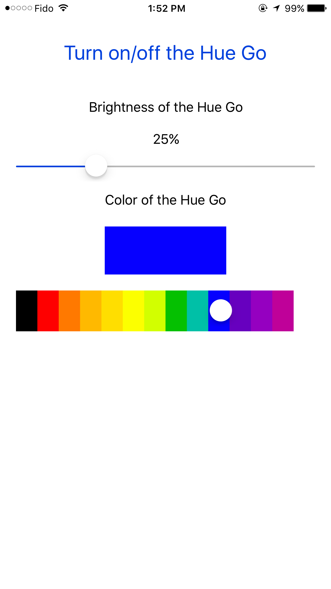

# simple-Philips-Hue-iOS-app
A simple Philips Hue app that allow you to control your light

## Technologies Used
- [Swift](https://swift.org/)

## Screenshots

## Disclaimer
Some of the code was derived and inspired from [add-a-color-picker-to-an-ios-app](http://stackoverflow.com/questions/21981640/add-a-color-picker-to-an-ios-app) by [suragch](http://stackoverflow.com/users/3681880/suragch).
